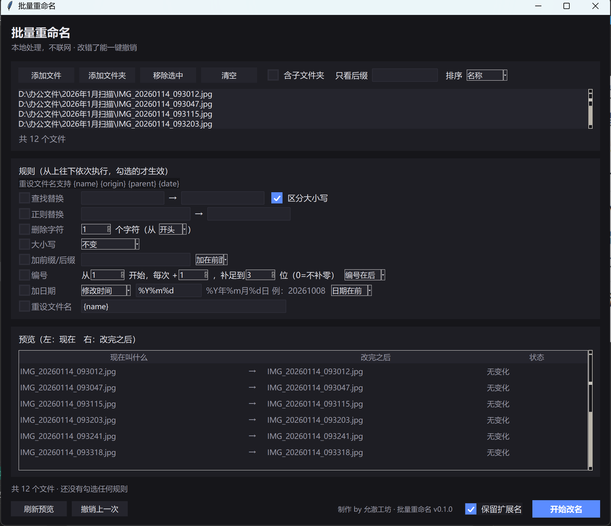
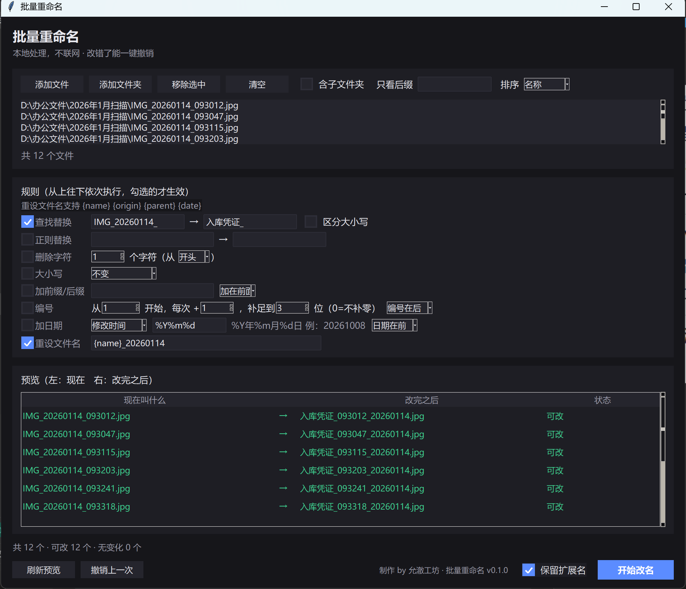
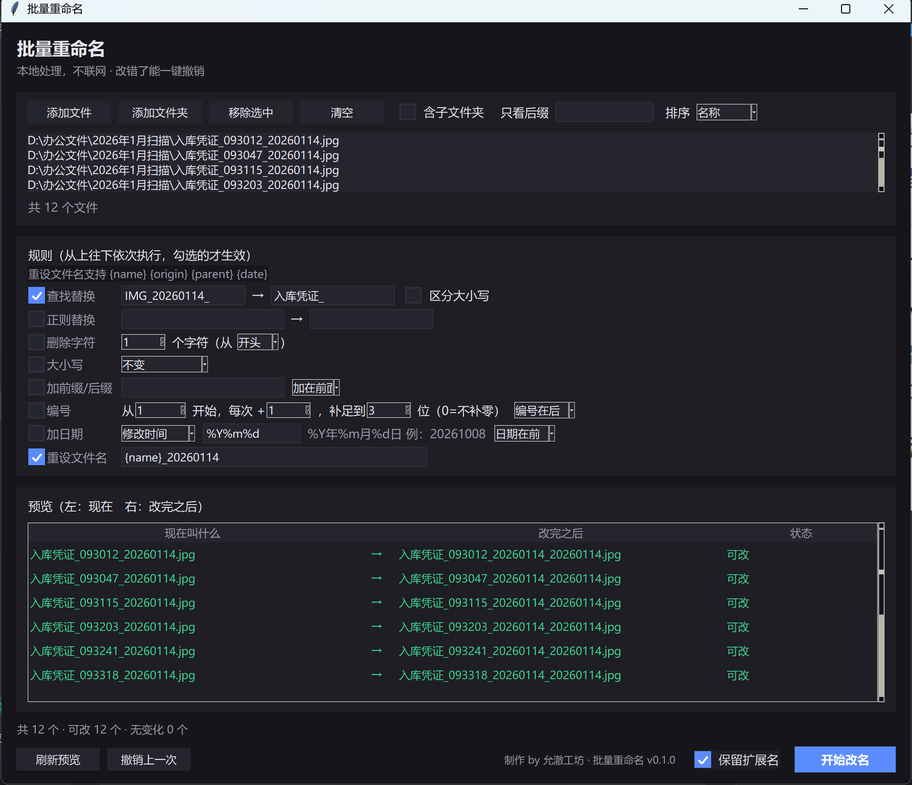

# 批量重命名 BatchRenamer

给内网办公电脑用的批量改名工具。**绿色单文件 exe，双击就用，不需要安装，不联网。**

改名这种事最怕改坏了收不回来，所以这工具的第一原则不是功能多，而是——**改错了能一键撤销**。

## 为什么还要做一个

- 内网电脑装不了软件（没管理员权限），在线改名网站又打不开
- 系统自带的批量重命名只能加个 `(1)` `(2)`，中英文混排还排不对
- 网上那些改名脚本跑完就跑完了，改坏了只能手动一个个改回去

## 能做什么

八条规则，从上往下依次执行，勾哪个用哪个：

| 规则 | 说明 | 典型用法 |
|---|---|---|
| 查找替换 | 把文件名里的一段文字换成另一段 | `IMG_` → `照片` |
| 正则替换 | 用正则表达式替换 | `\d+` → 空，去掉所有数字 |
| 删除字符 | 从开头或结尾删掉 N 个字符 | 去掉扫描件前缀的 `scan_` |
| 大小写 | 全小写 / 全大写 / 每个词首字母大写 | 统一英文文件名 |
| 加前缀后缀 | 在名字前面或后面统一加一段 | 加项目名、加版本号 |
| 编号 | 从 N 开始，每次 +M，可补足到指定位数 | `照片001` `照片002`，0 表示不补零 |
| 加日期 | 把文件的修改时间或创建时间加到名字里 | `20261008_报销单` |
| 重设文件名 | 用模板整体重写，支持占位符 | `发票_{date}_{name}` |

模板占位符：`{name}` 当前名字 · `{origin}` 原始名字 · `{parent}` 所在文件夹名 · `{date}` 修改日期 · `{index}` 序号（从 1 开始）

排序按**自然序**（`file2` 排在 `file10` 前面，不是字典序），这点对编号文件很重要。

## 截图







## 撤销怎么用

每次改名都会在那些文件所在的文件夹里写一个 `.batch_renamer_undo.json`，
点「撤销上一次」就按逆序还原回去。还原成功后日志文件自动删掉。

几种情况会跳过并在结果里说明：

- 文件已经被你手动挪走或删了
- 目标位置被别的同名文件占了
- 只改了大小写（Windows 大小写不敏感，得走两步，程序已经处理了）

## 安全设计

- **先预览再动手**：改名之前整批算一遍，撞名、名字非法、目标已存在都会标出来，标红的那些不会改
- **只动能改的**：预览里状态不是「可改」的文件，执行时直接跳过
- **非法字符自动清**：`< > : " / \ | ? *` 会被去掉，末尾的点和空格会削掉，`CON` `PRN` 这类 Windows 保留名会加个下划线
- **文件不上传**：没有网络请求，本地跑

## 跑起来

从 [本工具的 Release](https://github.com/yunche-workshop/office-toolkit/releases/tag/batch-renamer-v0.1.0) 下载 `BatchRenamer.exe`，双击。不用安装，也不需要管理员权限。

从源码跑：

```bash
python src/main.py
```

## 自己打包

```bash
# 用装了 PyInstaller 的那个 venv（Python 3.8 + tkinter 那套），别用系统 Python
python build.py
```

产物在 `dist/BatchRenamer.exe`。`build.py` 会按 `src/core.py` 里的 `VERSION`
生成版本元数据再传给 PyInstaller，所以 exe 右键 → 属性 → 详细信息里的版本号
和界面署名的那个 v0.1.0 永远是一致的。

## 技术说明

- **零第三方依赖**，只用 Python 标准库 + Tk，所以 exe 很小、启动快
- 核心逻辑都在 `src/core.py`，纯函数，不碰界面 → `python tests/test_core.py` 可直接跑 31 项单测
- 界面在 `src/ui.py`，DPI 感知 + 200% 缩放适配；窗口尺寸和字号统一过 `win32ext.px()`
- 图标由 `src/icon.py` 纯标准库现画（手写 PNG 编码再包 ICO），不依赖任何美术素材
- 版本号（`core.VERSION`）、简介（`core.SUMMARY`）、署名和品牌信息（`src/brand.py`）
  各只有一个来源，底部那行小字、关于窗、exe 属性读的都是这几处

## 界面署名

底部按钮栏右边有一行「制作 by 允澈工坊 · 批量重命名 v0.1.0」，点它弹关于窗：
工具名和版本、一句话简介、仓库地址、许可协议、运行环境、联网情况。
仓库那一行可以直接点（会叫出浏览器），也可以点「复制仓库地址」，
复制的是完整地址，包括 `https://`。

## 测试

```bash
python tests/test_core.py          # 核心逻辑 31 项
python tests/smoke_ui.py           # 界面冒烟 29 项（需要 tkinter，含署名与关于窗 13 项）
```

## 许可

MIT · 允澈工坊（[yunche-workshop](https://github.com/yunche-workshop)）
